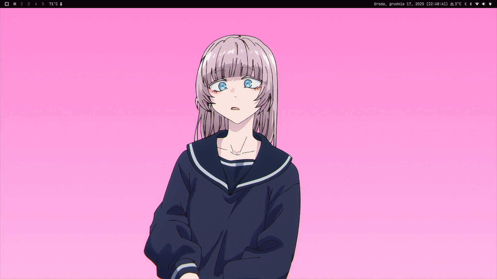
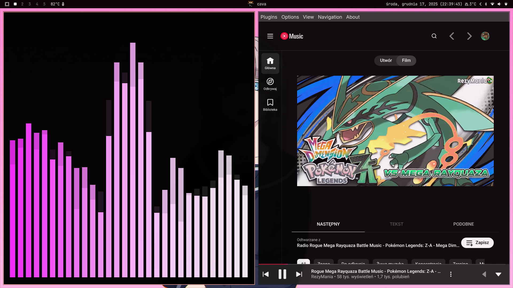

# ArixElo's Omarchy config
**Hello, here's my Omarchy distro config that I use on my machines with it. The purpose of that repo is not to only share my settings, it's also for making my life easier.** 

## Usage guide:
- Before using the script, make sure that you have generated locale-gen for your language, otherwise edit `/etc/locale.gen` with sudo privileges, and uncomment your language with UTF-8 standard, next run the `locale-gen` command with sudo privileges.
Omarchy by default comes with English (US) locales.
- Use dedicated script for automatic install packages and applying config: `./install-config.sh`
- Or, if you don't like scripts somehow, then here's what packages you need in order to apply everything without any issues:
- `waybar` ~ which is included by default, if you want to use other language for clock than Polish, then change the pl_PL-UTF.8 value in waybar's config for clock to other language, assuming you already generated locale for your language,
- `cava`  ~ for my theme,
- `wttrbar` ~ for weather in waybar, available on **AUR**,
- `zsh` ~ my favourite shell, with syntax higlighting and autocompletion,
- `starship` ~ for the looks in zsh,
- `kitty` ~ the terminal by default in Omarchy as of now is ghostty, but me personally don't like it, so I use kitty.
 It can be changed from `Omarchy Menu > Install > Terminal`
- And other apps that I think could be added to this repo.

## Binds:
My binds are a little bit different than what Omarchy gives you by default, because the default bindings aren't comfortable for me, so here's all binds that i changed or added;
- `SUPER+A` ~ Opens floating cava visualizer
- `SUPER+C` ~ Opens VSCode,
- `SUPER+B` ~ Opens default browser (by default it also uses the shift key, but i've removed the shift key from all my bindings to make my life easier),
- `SUPER+D` ~ Opens Discord,
- `SUPER+T` ~ Opens Telegram,
- `SUPER+F` ~ Opens File Manager,
- `SUPER+SHIFT+T` ~ toggle floating or tiling mode (default bind is `SUPER+T`, however as you see that is already reserved by Telegram bind)
- `SUPER+SHIFT+F` ~ Goes to fullscreen mode (that's only one shift bind which I sometimes use),
- `SUPER+L` ~ Quick account lock (enter password or use your finger to unlock your desktop)
- `SUPER+M` ~ Opens Pear Desktop (YouTube Music client, however you can change it to your preferred music player),
- `SUPER+Q` ~ Quit apps (by default is `SUPER+W`, however i do find that not comfortable for me, hence that's why that bind is changed as well).

## Additional info:
- As of the `tiling-v2.conf` file, you need to copy it into `~/.local/share/omarchy/default/hypr/bindings` i know that you shouldn't edit those, however i'm not gonna move out things that i changed before.
- README will be updated with even more **__info__**, if I get any new idea for things that will make my Omarchy experience even better.
- P.S: Feel free to fork, edit or whatever do want to do, however in your's fork README, __i'm kindly asking to include me as the original author.__
- Another info, few things were created with help from Claude AI, which helped me a lot with ideas that I had and might have.
If you encounter any problems, hit me up on: [Telegram](t.me/ArixElo), **Discord**: `arixelo`
Results of my configs:

